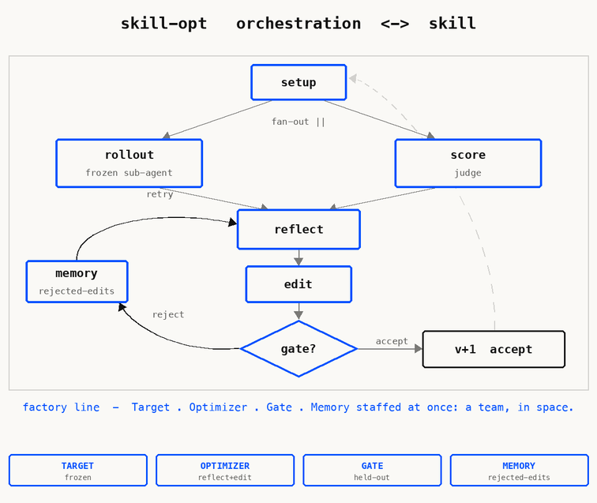

# skill-opt

A meta-skill that **optimizes other agent skills.** It ports Microsoft Research's
[SkillOpt](https://microsoft.github.io/SkillOpt/) into a single Claude Code skill: the target
`SKILL.md` is treated as a *trainable document* and improved against a scored task suite — while the
model stays frozen.

<p align="center">
  
</p>

<p align="center"><sub>
  ▶ <b>Play with it live</b> (toggle the modes, autoplay the walk):
  <a href="docs/one-man-show.html"><code>docs/one-man-show.html</code></a>
  &nbsp;·&nbsp; the GIF is reproducible: <code>python3 docs/build_one_man_show.py</code>
</sub></p>

---

## The idea: SkillOpt → a one-man show → a skill

**1 ▸ Microsoft's SkillOpt is an *orchestration* of four roles.** A frozen **Target** runs the skill
on tasks; an **Optimizer** reflects on the successes and failures and proposes a bounded edit; a
**Gate** keeps the edit only if it improves *held-out* performance; a **Memory** remembers what was
rejected so the same bad edit isn't tried twice. Four agents, passing artifacts between them — a team
working **in space.**

**2 ▸ The one-man-show insight.** Anything a team of agents does by passing messages, a *single*
agent can do by swapping hats in sequence: put on the Target hat and do that bit, take it off, check
the mailbox, put on the Optimizer hat, and so on. Re-staged that way, the orchestration becomes a
**one-actor play** — one agent, four hats, working **in time.** The only real difference between the
two is *parallelism*. (Flip the toggle in the diagram above and watch the team collapse into one
actor walking the same loop.)

**3 ▸ So SkillOpt becomes a skill.** That re-staging is exactly what makes SkillOpt expressible as a
*single* Claude Code skill. `skill-opt` is the one-man show: one agent cycles
**Setup → Rollout → Score → Reflect → Edit → Gate → Memory**, using a **run directory of files** as
the mailbox between hats. Because every hat reads and writes that directory, runs are **resumable from
any point** — and when speed matters, any hat can still fan out to parallel subagents (the line back
toward orchestration is a dial, not a wall).

The mailbox lives at `.skill-opt/runs/<skill>-<n>/`:

```
config.yml   skill/ v0.md v1.md … current.md   tasks/{train,holdout}/
rollouts/iter-NN/task-MM/   candidates/iter-NN/   memory/{rejected-edits,accepted-log}.md
ledger.csv   report.md
```

---

## Methodology — how the loop works

One agent walks this loop; the run directory is the message bus, so each phase reads and writes files
there.

```
SETUP   : questionnaire → config.yml; build/ingest suite → tasks/{train,holdout};
          snapshot skill/v0.md; ROLLOUT(v0) over holdout → baseline via `ledger.py record`.
LOOP iter=1..max  (early-stop after `early_stop_patience` non-improving gates, or user stop):
  ROLLOUT : for each train-minibatch task, dispatch a FRESH SUBAGENT given ONLY {skill text, task}
            → rollouts/iter-NN/task-MM/trajectory.md.
  SCORE   : judge each trajectory (programmatic if available, else LLM-judge subagent) → score.json.
  REFLECT : split the minibatch into SUCCESS and FAILURE; reflect on each SEPARATELY;
            read memory/rejected-edits.md first.
  EDIT    : propose bounded add/del/replace ops within edit_budget → candidates/iter-NN/.
  GATE    : ROLLOUT(candidate) over tasks/holdout (fresh subagents); `ledger.py gate` decides.
            accept → skill/v(K+1).md; reject → append memory/rejected-edits.md.
  MEMORY  : slow update — an established rule needs accumulated evidence to be overturned.
FINALIZE: emit per output_mode (overwrite w/ v0 backup, or save-as-new); write report.md.
```

### The five disciplines (non-negotiable)

These are what make a measured gain *trustworthy* rather than a self-report. Each maps directly to a
SkillOpt mechanism (full correspondence in [`skill/references/fidelity.md`](skill/references/fidelity.md)):

| Discipline | Why it matters |
|---|---|
| **Frozen target via fresh subagent** | Each rollout sees only `{skill text, task}` — no contamination, no self-grading. |
| **Gate only on held-out** | The accept decision never sees the tasks the edit was tuned on. |
| **Deterministic gate** | `scripts/ledger.py gate` does *arithmetic* on `ledger.csv`; an LLM never decides accept/reject. |
| **Edit budget** | Caps ops/words per iteration — the "textual learning rate" that stops catastrophic overwrites. |
| **Rejected-edit memory** | Consulted before every edit; known-bad edits aren't re-proposed without new evidence. |

Configuration is an up-front questionnaire ([`skill/templates/config.yml`](skill/templates/config.yml)):
`feedback_source` (`proposed-ratified ▸ autonomous ▸ user-suite ▸ live`), `feedback_timing`,
`output_mode` (`save-as-new ▸ overwrite`), edit/minibatch/holdout budgets, `parallelism`, and
`validation_depth`. See [`skill/references/feedback-sources.md`](skill/references/feedback-sources.md)
for how each `feedback_source` builds the suite.

---

## Experiments

### Proof run — does the loop actually move the number?

A self-contained testbed lives in [`playground/`](playground/): a deliberately-weak `seed-skill/` for
structured field-extraction, a 20-task suite, and a **programmatic** checker (`checker.py`) so any
gain is ground truth — not an opinion. Optimizing the weak seed skill
(`feedback_source=user-suite`, 3 iterations, holdout=4, parallelism=4):

| iter | candidate | held-out mean | gate | best after |
|---|---|---|---|---|
| 0 | v0 (baseline) | 0.700 | — | 0.700 |
| 1 | c1 (+date-ISO rule) | 0.750 | **accept** | 0.750 |
| 2 | c2 (+currency-code rule) | **1.000** | **accept** | 1.000 |
| 3 | c3 (+note-null rule) | 1.000 | **reject** | 1.000 |

- **Held-out gain: 0.700 → 1.000 (+0.30)**, every accept/reject decided by `ledger.py` arithmetic.
- **iter 3 is the discipline working:** c3 helps *train* but ties on *held-out* (the holdout had no
  absent-note tasks to validate it), so the strict gate **rejects** it and logs the signal "enlarge
  holdout." A self-grading optimizer would have kept it.

### Judge calibration — can we trust the LLM-judge on *real* skills?

The proof run uses a programmatic checker, but real skills usually have no oracle — you must trust an
LLM-judge. So we measured whether the gold-blind judge tracks the ground-truth checker:

- **Spearman ρ = 0.868 (n = 16)** between the LLM-judge and the programmatic checker.

That correlation is the result that *licenses* using the judge as the scoring signal on skills where
no programmatic checker exists. (`playground/calibration.py` reproduces it.)

Full write-up: [`.skill-opt/runs/extract-fields-1/report.md`](.skill-opt/runs/extract-fields-1/report.md).
Optimized skill: [`playground/seed-skill-opt/SKILL.md`](playground/seed-skill-opt/SKILL.md).

---

## Install

```bash
bash install.sh          # symlinks ./skill -> ~/.claude/skills/skill-opt
uv sync                  # dev env (pytest); shipped skill scripts are stdlib-only
uv run pytest -q         # 33 tests: ledger gate, checker, calibration, split, skill structure
```

The loader follows the symlink, so edits to `skill/` are live. Once installed, invoke it like any
skill — it triggers on "optimize / tune / harden / measurably improve a skill."

## Repository layout

```
skill/            the skill itself — SKILL.md + references/ + scripts/ledger.py + templates/
playground/       self-contained empirical testbed (weak seed skill + checker + calibration)
docs/             one-man-show.html (interactive) · one-man-show.gif · build_one_man_show.py
                  superpowers/{specs,plans}/ — design spec + implementation plan
tests/            33 tests across ledger / checker / calibration / split / skill structure
```

## Status / deferred

Built, tested (33/33), installed, and validated by the scaled proof run above. Deferred (per the
plan's optional tail): the full-budget run, the **dogfood** run (optimizing skill-opt's own
`SKILL.md`), and the `verifiers-env` / `full-ablation` validation depths.

> **Tip:** to serve the interactive explainer as a hosted page, enable **GitHub Pages** for this repo
> from the `docs/` folder — `one-man-show.html` is fully self-contained and will render at
> `https://<user>.github.io/<repo>/one-man-show.html`.
